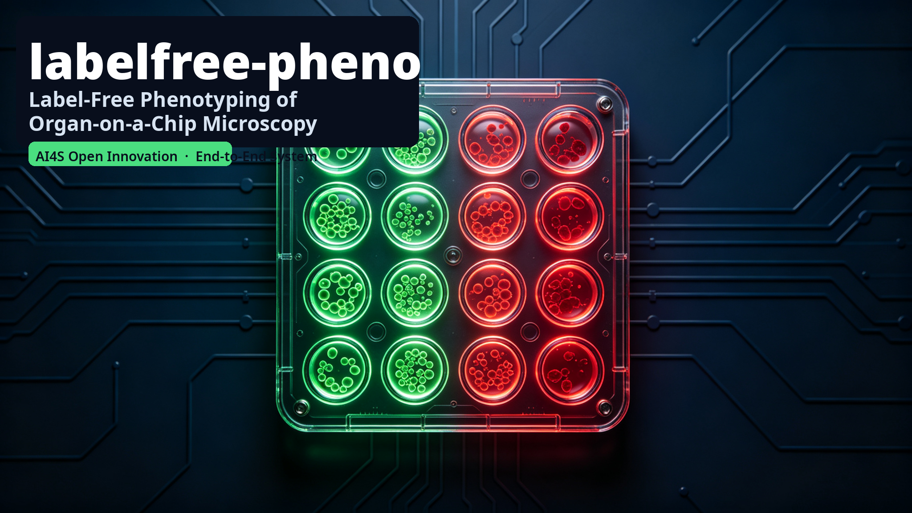

# labelfree-pheno

**Label-free phenotyping of organ-on-a-chip microscopy: bright-field → fluorescence
virtual staining, viability/phenotype scoring, and dose-response pharmacology.**

<p align="center">
  
</p>

An end-to-end system submitted to the *5th Pazhou Algorithm Competition — AI4S Open
Innovation: AI for Life Science* (Kaggle). Category: **End-to-End System**.

Staining is the bottleneck of organ-on-a-chip drug testing — every viability
measurement consumes reagents, imaging time, and manual curation. **labelfree-pheno
replaces it with AI: bright-field in, viability and dose–response pharmacology out —
free to reproduce** on public data and free compute.

## What it does

| Module | Input | Output |
|---|---|---|
| A. Virtual staining (in silico labeling) | bright-field image | predicted green (viable) + red (dead) fluorescence |
| B. Viability / phenotype scoring | predicted channels | per-field cell counts, dead fraction, viability |
| C. Dose-response pharmacology | RxRx3-core embeddings | within-plate perturbation scores → Hill fits (EC50/Emax) |

## Key results (real runs, all public & reproducible)

| Item | Value |
|---|---|
| Validation PSNR / SSIM (CPU quick-run, best epoch) | **24.65 dB / 0.79** |
| Held-out test overall (different camera/control) | **21.5 dB / 0.56** (green 19.8/0.59 · red 23.1/0.52) |
| Viability readout vs. real stain | honestly reported (n = 34, not yet significant; uncertainty-aware path documented) |
| Module C dose–response | **1,646 Hill fits**; Bortezomib EC50 ≈ 7 nM (R² = 0.966), digoxin ≈ 45 nM (R² = 0.981), RG-7112 ≈ 10.3 µM (R² = 0.895) |
| Uncertainty | MC-dropout with Dropout2d(0.1) — verified non-zero (std max ≈ 0.28) |

## Quick start (CPU, ~30-45 min)

```bash
git clone https://github.com/<org>/labelfree-pheno.git && cd labelfree-pheno
pip install -r requirements.txt
python scripts/smoke_test.py                        # E2E CI on synthetic data (~4 min)
python scripts/run_caco2_pipeline.py --epochs 8 --limit 120   # real data mini run
python scripts/make_figures.py --run runs/caco2_mini
```

## Full pipeline

```bash
python data/download_caco2.py --out data/caco2/raw       # figshare ~506MB
python data/make_caco2_pairs.py --root data/caco2/raw --out data/caco2/pairs.csv
python -m labelfree.train --config configs/train_caco2.yaml --out runs/caco2   # GPU
python -m labelfree.infer --config configs/infer.yaml --ckpt runs/caco2/best.ckpt \
    --csv data/caco2/pairs.csv --root data/caco2 --split test --crop 256 --out runs/caco2/infer
python -m labelfree.evaluate_cli --csv data/caco2/pairs.csv --root data/caco2 \
    --pred-dir runs/caco2/infer --split test --crop 256 --out runs/caco2/eval
```

## Module C (RxRx3-core dose response)

```bash
pip install huggingface_hub pandas pyarrow scipy
python scripts/rxrx3_dose_response.py --out runs/rxrx3
```

## Repository layout

```
configs/            train/infer YAML configs (smoke / mini / full)
data/               download & pair-building scripts
src/labelfree/      models (AttResUNet), losses, uncertainty, train/infer/eval CLIs
scripts/            smoke_test, run_caco2_pipeline, make_figures, rxrx3_dose_response
notebooks/          Kaggle GPU training notebook (free T4)
tests/              unit tests
```

## Data & licenses

- **Caco-2 Virtual-Staining Dataset** — figshare article 21971558, Scientific Data
  10:160 (2023), DOI 10.1038/s41597-023-02065-7. 252 paired fields (BF / green / red),
  slide-stratified 70/15/15 train/val/test.
- **RxRx3-core** — HuggingFace `recursionpharma/rxrx3-core`, CC BY 4.0. 222k wells,
  Cell Painting, 1674 compounds × 8 doses.

## Notes

- CPU config: `configs/train_caco2_mini.yaml` (base32/depth3, 192 crop, 8 epochs).
- Full GPU config: `configs/train_caco2.yaml` (base64/depth4, 256 crop, 60 epochs).
- MC-dropout (`--mc-samples 3`) provides per-pixel uncertainty maps.
